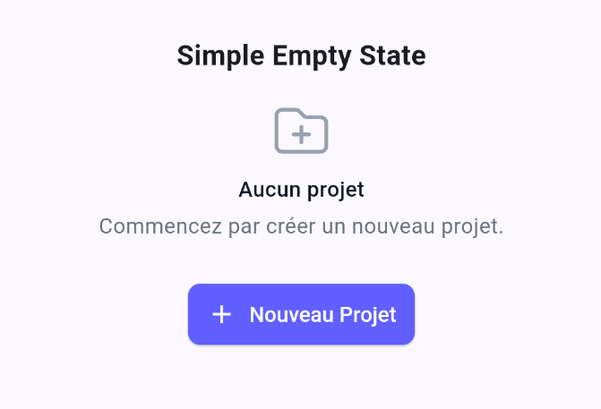
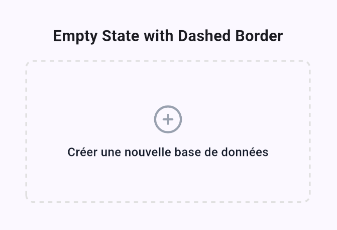
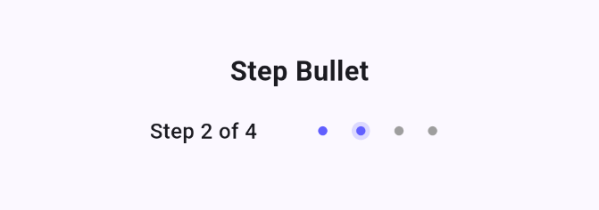
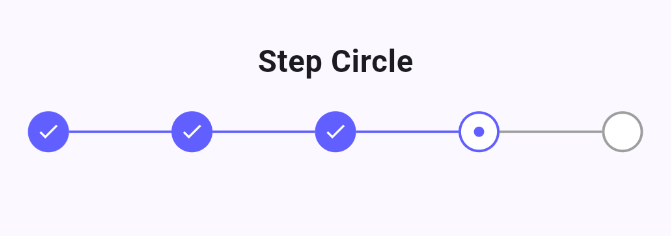
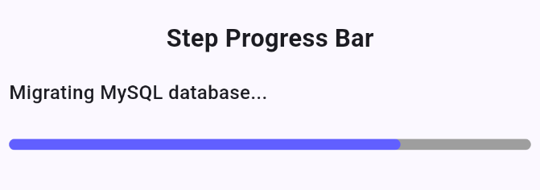

# Pure UI Kit

A Flutter UI kit inspired by Tailwind CSS, providing elegant and customizable components for your applications.

## Features

Pure UI Kit currently offers:

- Elegant and customizable "Empty State" components
  - Simple version with title, description, and action button



  - Dashed border version for drop zones or add areas



- Steps
  - Bullet step indicators



  - Circle step indicators



  - Progress bar step indicators



## Installation

Add Pure UI Kit to your `pubspec.yaml` file:

```yaml
dependencies:
  pure_ui_kit: ^0.1.2
```

## Usage

### Simple Empty State

```dart
PureEmptyState.simple(
  title: 'No projects',
  description: 'Start by creating a new project.',
  buttonText: 'New Project',
  onPressed: () {
    // Action on button click
  },
);
```

### Empty State with Dashed Border

```dart
PureEmptyState.withDashedBorder(
  title: 'Create a new database',
  onPressed: () {
    // Action on click
  },
);
```

### Steps

Pure UI Kit provides three types of step indicators: bullet, circle, and progress bar.

#### Basic Usage

```dart
// Bullet Step
PureStep.bullet(
  currentStep: 2,
  totalSteps: 4,
  onStepTap: (step) {
    print('Tapped on step $step');
  },
);

// Circle Step
PureStep.circle(
  currentStep: 3,
  totalSteps: 5,
  onStepTap: (step) {
    print('Tapped on step $step');
  },
);

// Progress Bar Step
PureStep.progressBar(
  currentStep: 2,
  totalSteps: 4,
  progressLabel: 'Processing...',
  onStepTap: (step) {
    print('Tapped on step $step');
  },
);
```

#### Customization

You can customize the appearance of steps using `PureStepTheme`:

```dart
PureTheme(
  stepTheme: const PureStepTheme(
    activeColor: Colors.blue,
    inactiveColor: Colors.grey,
    completedColor: Colors.blue,
    lineWidth: 60,
    lineHeight: 1.5,
    circleSize: 24,
    dotSize: 6,
    spacing: 8,
    labelStyle: TextStyle(
      fontSize: 14,
      fontWeight: FontWeight.w500,
    ),
  ),
  child: MaterialApp(
    // Your application
  ),
);
```

Available properties:
- `activeColor`: Color for the current step
- `inactiveColor`: Color for upcoming steps
- `completedColor`: Color for completed steps
- `lineWidth`: Width of connecting lines (circle step)
- `lineHeight`: Height of connecting lines and progress bar
- `circleSize`: Size of circle indicators
- `dotSize`: Size of bullet indicators
- `spacing`: Space between elements
- `labelStyle`: Text style for labels

### Theme Customization

You can customize the appearance of the components using `PureTheme`:

```dart
PureTheme(
  emptyStateTheme: const PureEmptyStateTheme(
    titleStyle: TextStyle(
      fontSize: 16,
      fontWeight: FontWeight.bold,
      color: Colors.indigo,
    ),
    iconColor: Colors.indigo,
    dashedBorderColor: Colors.indigo,
  ),
  child: MaterialApp(
    // Your application
  ),
);
```

## Coming Soon

New components will be added soon, including:

- Buttons
- Form fields
- Cards
- Alerts
- And much more!

## Contribution

Contributions are welcome! Feel free to:

1. Fork the project
2. Create a branch for your feature
3. Commit your changes
4. Push to the branch
5. Open a Pull Request

## License

This project is licensed under the BSD 3-Clause License - see the [LICENSE](LICENSE) file for details.

